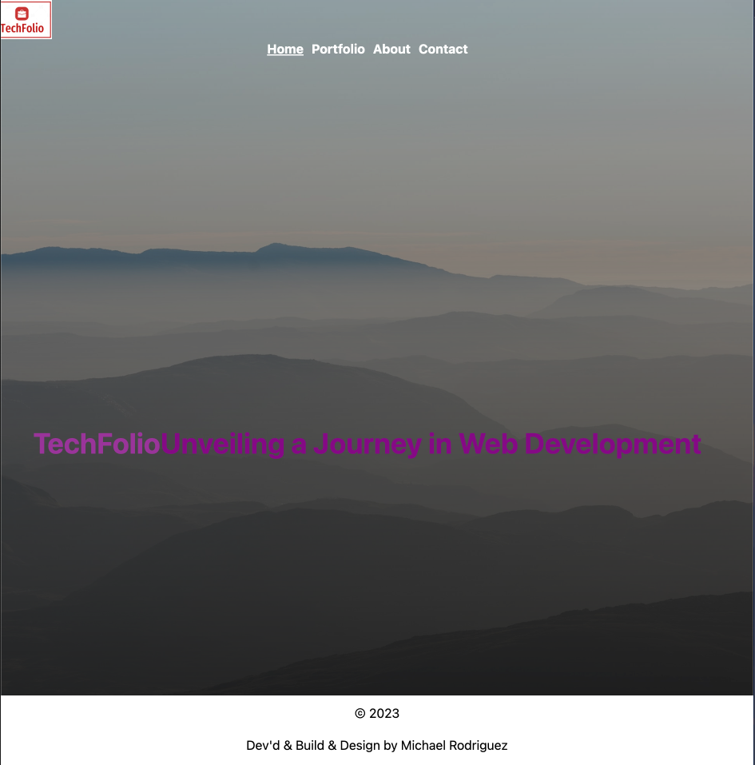

# Techfolio React Portfolio Site

## Description
Being a web developer means being part of a community. You'll need a place to share your projects not only if you're applying for jobs or working as a freelancer but also so that you can share your work with fellow developers and collaborate on future projects.

This project aims to help you create a portfolio using React, showcasing your skills and projects in an interactive and modern way. The portfolio includes sections such as About Me, Portfolio, Contact and Resume.

## Table of Contents
- [User Story](#user-story)
- [Acceptance Criteria](#acceptance-criteria)
- [Mock-Up](#mock-up)
- [Getting Started](#getting-started)
- [Projects](#projects)
- [Design](#design)
- [Contact](#contact)

## Landing Page

## User Story
As an employer looking for candidates with experience building single-page applications, I want to view a potential employee's deployed React portfolio of work samples so that I can assess whether they're a good candidate for an open position.

## Acceptance Criteria
- The portfolio presents a header, content sections, and a footer.
- The header includes the developer's name and navigation links to different sections.
- Navigation titles include About Me, Portfolio, Contact, and Resume.
- Clicking on a navigation title reveals the corresponding section without page reloading.
- The About Me section displays a photo/avatar and a short bio.
- The Portfolio section features images of six projects with links to deployment and GitHub.
- The Contact section includes a form for name, email, and message.
- Form fields provide required notifications and email validation.
- The Resume section provides a link to a downloadable resume and a list of skills.
- The footer includes links to GitHub, LinkedIn, and another platform.
- The default section displayed is About Me.

## Mock-Up
[Link to animation or GIF showcasing the project functionality]

## Getting Started
1. Clone this repository.
2. Navigate to the project directory in your terminal.
3. Run `npm install` to install dependencies.
4. Run `npm start` to start the development server.
5. Open your browser and visit `http://localhost:3000` to view the portfolio.

## Projects
For each project featured in the portfolio, the following information should be provided:
- Image of the deployed application
- Project title
- Link to the deployed application
- Link to the GitHub repository

## Design
- Implement mobile-first design principles.
- Choose a unique color palette using resources like Coolors or similar tools.
- Ensure legible font sizes and comfortable color combinations.
- Consider incorporating animations and React component libraries to showcase your skills.

